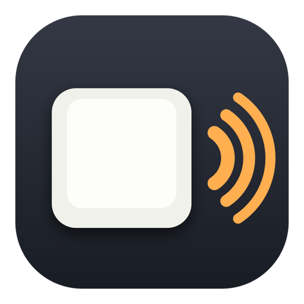

<p align="center">
  
</p>

# thock

Mechanical keyboard sounds for your Mac — with **key force**: on MacBooks
with a motion sensor, thock reads how hard you hit each key and plays the
sound louder, brighter and a touch higher for firm hits, softer and duller
for light ones.

- Lives in the menu bar. Click the keyboard icon to pick a sound, set the
  volume, or switch it off.
- Seven recorded packs included (Cherry MX Blue/Brown/Red/Black, Topre,
  Holy Pandas, NK Cream). Import any [Mechvibes](https://mechvibes.com)
  pack with drag & drop.
- ~5 ms from keystroke to sound. Own render path, no per-key allocation.
- Free, open source (MIT), no account, no telemetry. The only network
  request is an optional check for new releases on GitHub.

## Install

Download the latest `thock-<version>.dmg` from
[Releases](https://github.com/obsiidi/thock/releases), open it and
drag **thock** into **Applications**.

thock is not notarized by Apple (that costs $99 a year; this is a free
project). The first launch therefore needs one extra step on macOS 15+:

1. Open **thock** from Applications. macOS says it "was not opened".
2. Open **System Settings › Privacy & Security**, scroll down, click
   **Open Anyway** next to thock, confirm with your password.
3. thock now starts and shows its setup window. Follow it to allow
   **Input Monitoring** (System Settings › Privacy & Security › Input
   Monitoring › thock). macOS may offer to quit and reopen thock — accept.

That's it — from then on it just runs. The permission survives updates.

### Alternatives

Skip the Gatekeeper step entirely by removing the quarantine flag after
copying the app:

```bash
xattr -d com.apple.quarantine /Applications/thock.app
```

Or install with Homebrew (once the tap exists — see `Tools/homebrew/`):

```bash
brew install --cask --no-quarantine obsiidi/thock/thock
```

## Requirements

- macOS 13 Ventura or later, Apple Silicon or Intel.
- **Key force** needs the chassis motion sensor: MacBook Pro/Air with
  M1 Pro/Max or any M2 or later chip. Without it (M1 Air, 13" M1 Pro,
  desktops, Intel, external keyboards) thock plays at a fixed loudness and
  says so in its popover.

## Privacy

thock needs **Input Monitoring** to see key presses — the same permission
any keyboard-sound app needs. It turns each press into a sound and nothing
else: no keystrokes are stored, logged, or sent anywhere. The motion sensor
is read for impact strength only. Verify it in the source: all key handling
lives in `Sources/thock/KeyTap.swift` and `Pipeline.swift`.

## Build from source

Needs the Xcode Command Line Tools (no Xcode, no paid account).

```bash
swift build                       # CLI build
swift run thock --selftest        # audio pipeline self-test, exit 0/1
Tools/bundle.sh                   # dist/thock.app (universal, self-signed)
```

`Tools/bundle.sh` signs with a self-signed identity named `thock-dev`
(create it with `Tools/make-cert.sh`) so the Input Monitoring grant
survives rebuilds. Without it the app is signed ad-hoc and macOS asks again
after every build. `Tools/release.sh` produces the DMG.

If you own a Developer ID: `THOCK_IDENTITY="Developer ID Application: …"
THOCK_NOTARIZE=1 Tools/bundle.sh` signs with hardened runtime and
notarizes via `notarytool` (keychain profile `thock-notary`).

### Diagnostics

The app binary is also a CLI:

```
thock --diag              log one line per key (name, sample, force, latency)
thock --selftest          synthetic keystrokes, latency and render proof
thock --selftest --burst 20
thock --diag-motion       motion sensor vs. key events (no key codes logged)
thock --motion-selftest   10 light + 10 hard hits, checks they separate
thock --list-packs        packs and how many keys each one maps
thock --map --pack NAME   key → scancode → sample table
thock --help
```

## How it works

`CGEventTap` (listen-only) → lock-free ring → trigger thread → command ring →
`AVAudioSourceNode` mixing 16 one-shot voices. The accelerometer
(`AppleSPUHIDDevice`, ~800 Hz) feeds a second ring; on each key-down the
peak around the event becomes a force that sets gain, low-pass and pitch.
Details and measurements in `PROGRESS.md` (German).
